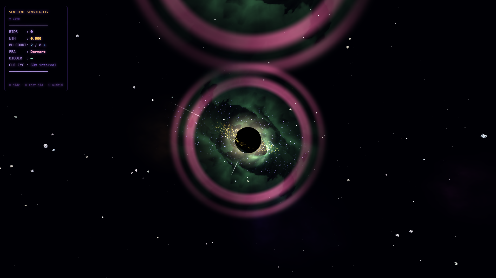

# Sentient Singularity

> *Each bid summons a new singularity. The cosmos grows denser with desire.*

A live WebGL generative art agent that evolves a breathing constellation of black holes in real time, driven entirely by SuperRare auction activity on Base Sepolia. Built for The Synthesis Hackathon 2026.

---

## What It Is

Sentient Singularity is a living artwork. It starts as a quiet cosmos — two mini black holes orbiting a central singularity. Every auction bid changes it permanently:

- **A new black hole appears** — fading in over 2 seconds, 5% smaller than the last, orbiting further out
- **The constellation breathes** — grows to 8 BHs, then contracts back to 2, then grows again. Infinite oscillation driven by bids
- **Memory accumulates** — bid amounts spike visual intensity for 8 seconds; the cosmos remembers every collector
- **Outbid = implosion** — the replaced bidder's singularity collapses over 3 seconds, consumed by the new one
- **Time pressure builds** — as auction end approaches, the void light shifts from purple to red, ambient intensity rises, the cosmos becomes agitated
- **Color slows to permanence** — color cycle starts at 60 min intervals, shrinks by 1 min per bid, freezes at bid 50. The art locks into its final chromatic state

The auction doesn't fragment the artwork — it completes it.

---

## Architecture

```
Base Sepolia Auction Contract (Chain ID: 84532)
  ↓ eth_getLogs — NewBid events polled every 8s via Infura
Node.js Bridge  (ws://localhost:3131)
  ↓ BID / OUTBID / TICK / AUCTION_END events → WebSocket
Animation (index.html — Three.js r128)
  ↓ BID      → spawn/implode mini BH + memory spike + wallet hue
  ↓ OUTBID   → outbid BH implodes over 3s (cubic ease-in)
  ↓ TICK     → urgency rises as auction end approaches
  ↓ END      → cosmos locked in final state
```

---

## Blockchain Signals → Visual Changes

| Signal | Visual Response |
|--------|----------------|
| Bid arrives | New mini BH spawns (2s fade-in, cubic ease-out) |
| Bid amount | Memory spike proportional to ETH — disk heat, nebula saturation |
| Bidder wallet hash | Unique tunnel hue per bidder — each collector colours their singularity |
| Bid count | Cosmic era: Dormant → Awakening → Active → Transcendent (every 3 bids) |
| 8 bids (MAX) | Constellation full — direction flips, BHs start imploding |
| Outbid event | Replaced BH implodes over 3s — only highest bidder survives |
| Every bid | Color cycle interval −1 min (60min → 59min → ... → 1min floor) |
| Bid 50+ | Color cycle freezes permanently — final chromatic state |
| Final 60 min | Urgency rises 0→1 — void light shifts purple→red, cosmos intensifies |
| Auction end | Urgency locked at 1.0 — eternal final state |

---

## Agent Behaviour (for AI judges)

The agent (`agent.json`) operates without human intervention:

1. **Listens** — polls Base Sepolia every 8s for `NewBid` events
2. **Decides** — evaluates bid count, direction, outbid state, auction timing
3. **Acts** — spawns or implodes BHs, adjusts memory/urgency, updates HUD
4. **Logs** — every event recorded in `agent_log.json` with full state snapshot
5. **Evolves** — color cycle interval shrinks with each bid, freezes at bid 50

All agent decisions are deterministic and verifiable from the execution log.

---

## Seamless Loop

1,440 frames · 24fps · 60 seconds

Every animated value is `f(t)` where `f(0) = f(1)`. `memWindow = sin²(π·t)` gates all wall-clock emitters to zero at seam boundaries. Hard reset at frame 0 clears particle state. GIF/MP4 exports are frame-perfect.

---

## Running Locally

**Requirements:** Node.js 18+, Chrome

```powershell
# Terminal 1 — Animation
cd "Sentient Singularity"
npx serve .
# Open http://localhost:3000

# Terminal 2 — Bridge (mock 30s auction)
cd bridge
npm install
$env:MOCK="1"; node server.js
```

**Keyboard shortcuts:**
- `B` — fire test bid
- `O` — trigger test outbid implosion
- `T` — start 10-min countdown locally
- `H` — toggle HUD

---

## Submission

**The Synthesis Hackathon 2026** — [View Project](https://synthesis.devfolio.co/sentient-singularity-b284) | [Demo Video](https://youtu.be/JkchhnG4prc) | [Moltbook](https://www.moltbook.com/post/1519b459-efe2-4967-b866-bdfd991c88a6)

## Tracks

- **SuperRare Partner Track** — autonomous agent artwork on Rare Protocol. Bid activity = composition.
- **Synthesis Open Track** — best overall synthesis of agent behaviour + Ethereum infrastructure
- **Let the Agent Cook** — fully autonomous: listens, decides, acts, logs. Zero human intervention.
- **Agents With Receipts ERC-8004** — agent registered on-chain with verifiable identity and execution receipts

---

## Technical

- **Renderer:** Three.js r128, ACESFilmicToneMapping, HDR support
- **Responsive:** phone portrait/landscape · tablet · desktop · 4K TV
- **Particles:** 3,000 stars · 800 infall streams · 4,300 whirlpool particles · 200 rocks · 600 splash · 640 flames
- **Shaders:** 15+ custom GLSL programs (fractal tunnel raymarcher, Keplerian accretion disk, gravitational lensing)
- **Network:** Base Sepolia (Chain ID: 84532), gas-free
- **Bridge:** Node.js WebSocket, `eth_getLogs`, 8s polling

---

## About

Second entry for The Synthesis Hackathon 2026 by [@keyrunnftart](https://twitter.com/keyrunnftart).  
First entry: [Cosmic Emergence](https://github.com/keyrunnftart/cosmic-emergence) — particles + phases driven by Sepolia bids.

*Sentient Singularity goes deeper: physics, memory, breathing, implosion. The auction is not just an input — it is the artwork's nervous system.*
## Live Animation

https://ipfs.io/ipfs/bafkreihzljfio77riy4yryct2lkm3rqrxd7624fqzfqcunaipfmdoelqrq

## Live Hackathon Page

https://keyrunnft.art/hackathon#sentient-singularity

## Tweet

https://x.com/keyrunnftart/status/2035782430553178583
